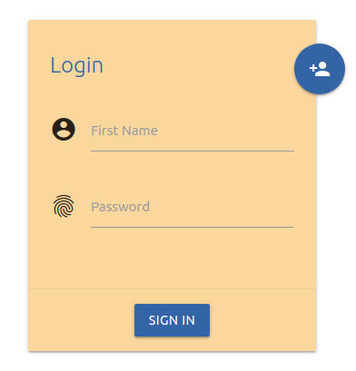
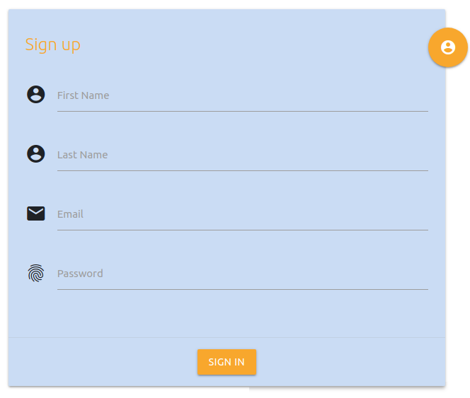

# Dynamic Login

This is a simple Material Design Web App for doing forms. It's easy to customize, not only the colors, but also the fields. It's responsive, so you can run it in any device.

## Open project

Just download the project and open the `html` file. You should see something like this:


It's a simple Login card, but if you click on the floating action button then Sign up form shows up:


## Code

The JavaScript code follows the MVC architectural pattern, so adding and modifying code will be easy. Also this makes the code less coupling , cleaner and easy scalable.

To change **colors** and add **fields**  you will only have to modify `scripts/script.js`

### Change colors

You can easily change the colors with this object that you'll find in the Model

```js
    colors: {
      background: "#FFFFFF",
      primary: "#FFA726",
      secundary: "#2366A6",
      primaryCardBackground: "#FFD79E",
      secundaryCardBackground: "#C9DEF4"
    },
```

### Add fields to the card

To create a field you just have to create a `formData` object by calling the `form` function and then you add the html code by calling the `addForm` function.

```js
    form: function(icon, labelName) {
      var formData = {
        icon: icon,
        labelName: labelName
      };
      return formData;
    },

    addForm: function(form) {
      var formHTML = '<div class="input-field col s12">' +
        '<i class="material-icons prefix">' + form.icon + '</i>' +
        '<input id="icon_prefix" type="text">' +
        '<label for="icon_prefix">' + form.labelName + '</label>' +
        '</div>';
      return formHTML;
    },
```

**Example:**

```js
    loginForm: {
      firstname: Controller.NewForm("account_circle", "First Name"),
      password: Controller.NewForm("fingerprint", "Password")
    },
    for (let form in this.loginForm) {
        this.DOMelements.formArea.insertAdjacentHTML('beforeend', Controller.addNewForm(this.loginForm[form]));
    }
```

Check the View to see how I use the floating button and change the colors.

## Built With

All the icons and colors you could use are in the Materialize documentation.

-   [Materialize](http://materializecss.com/) - A responsive css framework
